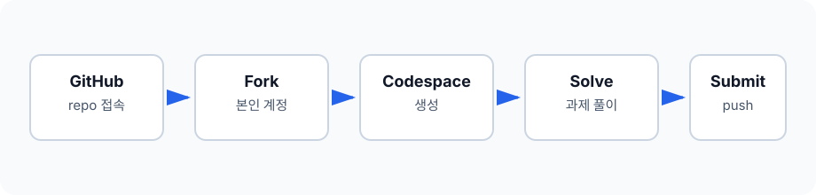

# cuop-interview-2026-05 제출

- 응시자:

## 응시 안내

이 저장소를 본인 GitHub 계정으로 fork한 뒤 Codespaces에서 과제를 진행하세요.



## 1. GitHub 저장소 접속

1. 아래 저장소에 접속합니다.
   - https://github.com/bookend-tech/cuop-interview-2026-05
2. GitHub에 로그인되어 있는지 확인합니다.

## 2. Fork 생성

1. 저장소 오른쪽 상단의 **Fork** 버튼을 클릭합니다.
2. Owner가 본인 GitHub 계정인지 확인합니다.
3. **Create fork** 버튼을 클릭합니다.
4. fork가 완료되면 본인 계정 아래의 저장소로 이동합니다.

## 3. Codespace 생성

1. fork한 저장소 화면에서 **Code** 버튼을 클릭합니다.
2. **Codespaces** 탭을 선택합니다.
3. **Create codespace on main** 버튼을 클릭합니다.
4. Codespaces가 열릴 때까지 기다립니다.

## 4. 과제 풀이

Codespaces가 열리면 파일을 수정해서 과제를 풉니다.

1. `a_height_check.py`
2. `b_tree_check.py`
3. `c_react_state_update.html`
4. `d_sql_select_question.py`

c번 과제는 브라우저 실행이 필요합니다. Live Server 설치와 실행 방법은 `c_live_server_guide.md`를 확인하세요.

## 5. 실행 확인

Python 과제는 터미널에서 아래처럼 실행합니다.

```bash
python a_height_check.py
python b_tree_check.py
python d_sql_select_question.py
```

c번 과제는 Live Server로 `c_react_state_update.html`을 실행한 뒤 화면의 `PASS` 여부를 확인합니다.

## 6. 제출

제출 방법은 `e_submit.md`를 확인하세요.
